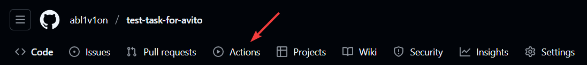
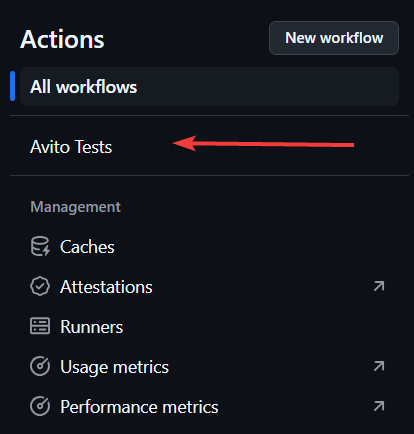
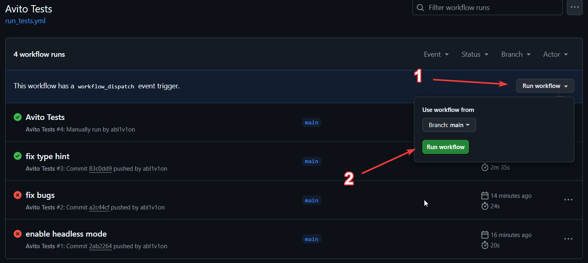
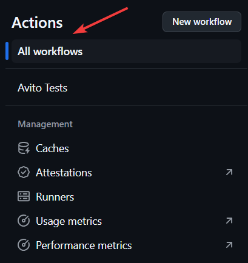
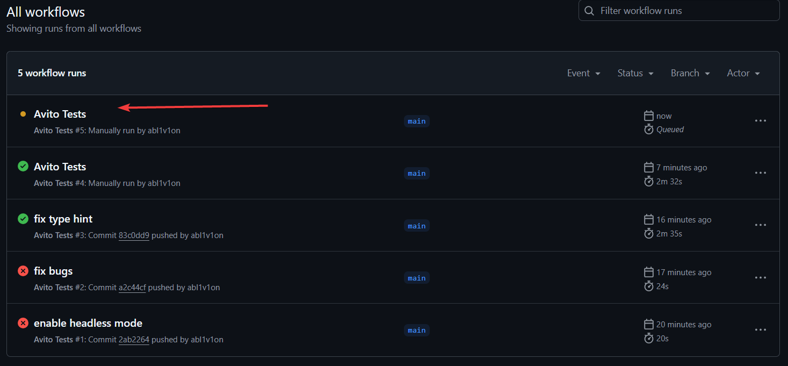

## Установка Python

1. **Windows** - Скачайте с [официального сайта Python](https://www.python.org/downloads/windows/), установите и **отметьте галочку** `Add Python to PATH` в процессе установки;
2. **Linux** - Откройте терминал и выполните:

    ```
    sudo apt update
    sudo apt install python3.11 python3.11-venv python3.11-dev -y
    ```

3. Проверка успешной установки:

    ```jsx
    # Windows
    python --version
    # Linux
    python3 --version
    ```

## Клонирование репозитория

1. Установите GIT:
    - **Windows**: Скачайте и установите Git с [официального сайта](https://git-scm.com/download/win);
    - **Linux**:  Откройте терминал и выполните:
    
        ```jsx
        sudo apt install git
        ```
    
2. Клонируйте репозиторий:

    ```jsx
    git clone https://github.com/abl1v1on/test-task-for-avito.git
    cd test-task-for-avito/task2-2/
    ```

## Виртуальное окружение и установка зависимостей

1. Создайте и активируйте виртуальное окружение:

    ```jsx
    # Windows
    python -m venv .venv
    . .venv/Scripts/activate

    # Linux
    python3 -m venv .venv
    source .venv/bin/activate
    ```

1. После активации виртуального окружения установите зависимости:

    ```jsx
    pip install -r requirements.txt
    ```

## Запуск тестов
Перед запуском тестов убедитесь, что на вашем компьютере установлен **Google Chrome.** Если хотите, чтобы тесты проходили в фоновом режиме, установите `—headless` мод в настройках:
```
# conftest.py

@pytest.fixture(scope='session')
def options() -> Options:
    chrome_options = Options()
    chrome_options.add_argument('--headless')
    return chrome_options
```

Запустите тесты из директории `tests/`:

```
pytest -s -v tests
```

## Запуск тестов через GitHub Actions
Для того, чтобы запустить тесты с помощью GitHub Actions перейдите на вкладку Actions, в списке в левой части экрана найдите "Avito Tests", нажмите на выпадающий список Run Workflow, а после на кнопку "Run Workflow". После этого перейдите во кладку "All workflows", выберите последний запуск и наблюдайте за процессом.










